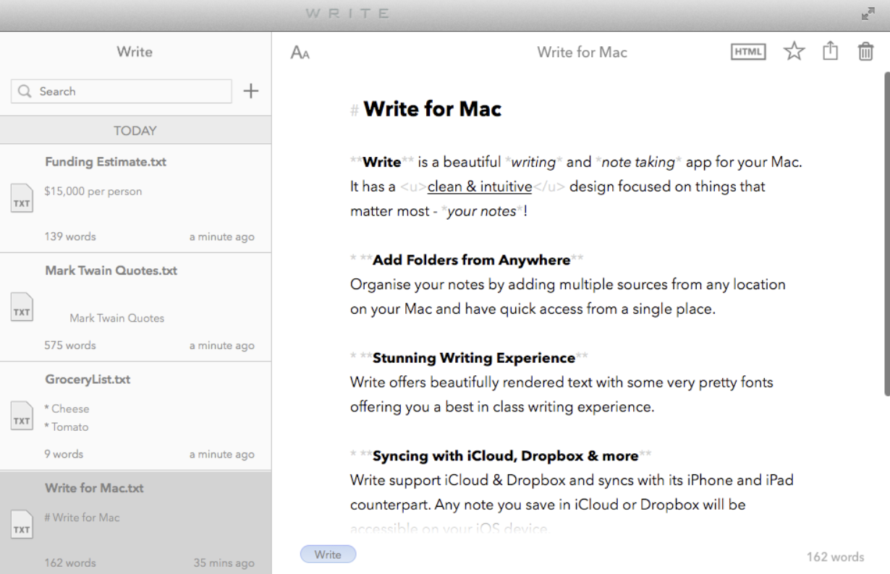
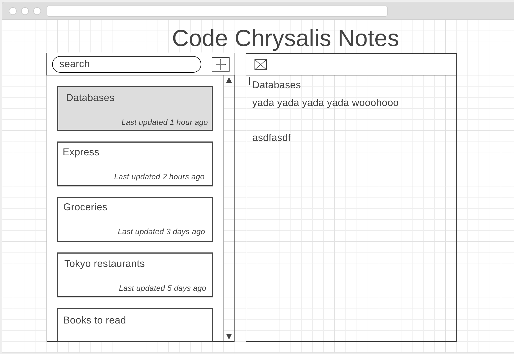
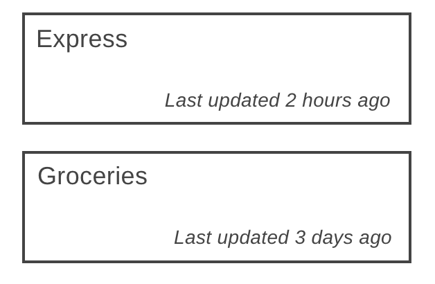
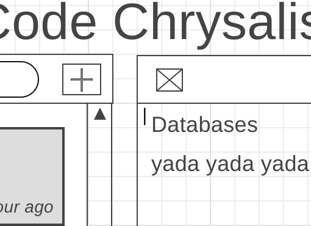
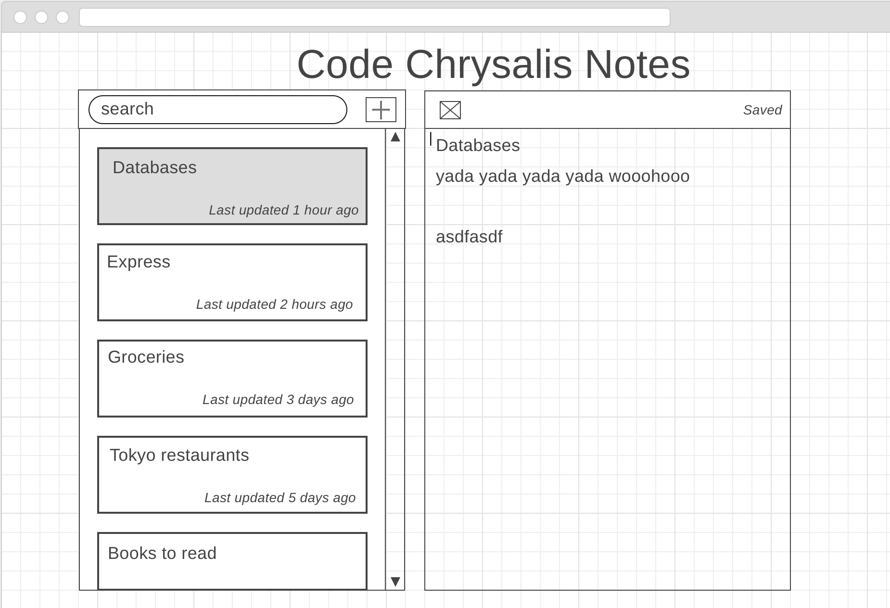

# 中間レビュー（Part 2）

これはコース中間レビュー（Part 2） です。今日の締め切りまでにプルリクエストを行ってください。
課題は一般的なフルスタックのノートアプリの作成です。時間が余ったら、機能を追加してさらに魅力的なアプリにしてみてください！

<!-- toc -->

- [ルール](#ルール)
- [プルリクエスト](#プルリクエスト)
- [要件](#要件)
  - [作業を始めるにあたって](#作業を始めるにあたって)
  - [フロントエンド](#フロントエンド)
    - [フロントエンドの基本要件](#フロントエンドの基本要件)
    - [フロントエンドの高度要件](#フロントエンドの高度要件)
  - [サーバーサイド](#サーバーサイド)
    - [サーバーサイドの基本要件](#サーバーサイドの基本要件)
    - [サーバーサイドの高度要件](#サーバーサイドの高度要件)
  - [データベース](#データベース)
    - [データベースの基本要件](#データベースの基本要件)
    - [データベースの高度要件](#データベースの高度要件)
  - [デプロイメント](#デプロイメント)
    - [デプロイメントの基本要件](#デプロイメントの基本要件)
- [何を求めているのか](#何を求めているのか)

<!-- tocstop -->

## ルール

1.  **Google で検索してもかまいません。** ただし...
    - ほどほどにしましょう。
    - コードのコピーペーストは禁じます。
1.  ChatGPT や CoPilot など AI によるコード生成ツールの使用は禁じます。
1.  公式ドキュメントやコード例を見てもかまいませんが、このレビューの目的は自分が限られた時間の中でどれだけのことをできるかをあなた自身が確認し、コースで残された時間をどう配分するかを考える糧にすることです。自分自身で書いたコードであっても意味を分からず書き写すのはせっかくのレビューを行う意味をなくしてしまいます。絶対に止めましょう。
1.  コードのテストは **任意です** が実施することを強く推奨します。
1.  このアセスメントの各セクションに対して採点することを忘れずに！

## プルリクエスト

プルリクエストを作る際には `pull_request_template.md` の質問に答えてください。

そこでプルリクエストの説明を書く箇所があります。その際、デプロイしたアプリの URL を記載してください。

## 要件

**重要です！**

作業を始める前に設問をよく読んで理解してください。**進め方について分からないことがあるときには、すぐにインストラクターに伝えてください。**

フルスタックアプリを作成し、Render でデプロイします。スタックには以下の要素が含まれるようにしてください。

- React
- Node/Express
- Knex
- Postgres
- Render

このようなメモを取るフルスタックアプリを作成してください。

### 作業を始めるにあたって

主にバックエンド側で一部コードが書かれていますが、まだ多くの作業が残っています。

ファイルの準備と Knex の設定はできていますが、使っている OS と ファイル構成によっては若干、調整する必要があるかもしれません。ただし、用意されているファイルやフォルダーは移動したり、名前を変えたりしないでください。

フロントエンド側では client フォルダが用意されいるだけです。React アプリを０から設定する必要があります。

#### その他の注意事項

- .env.example ファイルは適切に使うため名前を変える必要があります。
- package.json ファイルはプロジェクトのルートにはないので、コマンドの実行時にはまず適切なフォルダに cd することを忘れずに。
- package.json ファイル中の scripts はまだ完成していません。これも皆さんが完成させましょう。

### フロントエンド

フロントエンドの表示は上のサンプルと完全に一致する必要はありませんが、できるだけ同じようにしてください。

#### フロントエンドの基本要件

以下に予想されるユーザーの使い方を記します。細かなところまですべて実装する時間はないかもしれませんが、Create（作成）、Read（読み込み）、Update（更新）、Delete（削除）という基本的な使い方はできるようにしましょう。

- READ: ユーザーから見て左側にノートカードのリスト、右側に入力用のテキストボックス（ノートを取るスペース）が 1 つ見えるようにします。右のテキストボックスには選択しているノートのテキストが表示されます。

  - ノートカードは時間に基づいて並びます。（ワイヤーフレーム図を見てください。）
  - 各ノートカードにはノートの内容を表すタイトルと、最後の更新時間が示されます。

  

  - ノートのタイトルはノートを取るスペースの一行目から取られます。一行目が長すぎる場合は、一行目の最初の 25 文字だけを取ります。 (ワイヤーフレームを見てください。)
  - ノートカードをクリックするとそのテキストがノートを取るスペースとノートカード自体に表示されます。（ワイヤーフレームを見てください。）

    

- CREATE: ユーザーが "Add" と書かれたボタンをクリックすると左側に何も書いていない 1 枚のノートカート、右側にノートを取るスペースが作られます。

  - ノートを取るスペースに 1 行目が書かれると、左側に表示された対応するノートカードが更新されます。

  

- DELETE: ユーザーはノートを取るスペースの上にある "Delete" と書かれたボタンをクリックすることができます。
  - "Delete" ボタンをクリックするとリストからノートが消えます。
  - ノートを取るスペースに次に使えるノートが表示されます。
- UPDATE: ユーザーはノートを取るスペースにテキストを書けます。

  - ユーザーがノートを取るスペースに最初の 1 行を書くと、左側のカードのタイトルが更新されます。
  - ノートは自動保存されます。キーボードからの入力が止まって 5 秒経つ、あるいは別のノートに移ると "Saved" というテキストが現われます。

    

#### フロントエンドの高度要件

- ノートカードのリストの左側に検索バーを作り、検索すると結果が表示されるようにします。

### サーバーサイド

#### サーバーサイドの基本要件

- サーバーはフロントエンドが使える API を提供するようにします。エンドポイントは RESTful なものにしてください。
- すべての CRUD オペレーションが行えるよう機能を揃えてください。
  - ノートを作成する。
  - 全てのノートをリストする。
  - ノートを読む。
  - ノートを更新する。
  - ノートを削除する。

#### サーバーサイドの高度要件

- 検索機能を追加してください。

### データベース

#### データベースの基本要件

1.  データベースには PostgreSQL を使ってください。
1.  データベース用のシードファイルを作成し、データをデータベースに入れるスクリプトを書いてください。
1.  データベースのマイグレーションを作ってください。
1.  シードファイルは必要ではないですが、作ることを強く推奨します。
1.  データベースをサーバーと接続してください。
1.  `package.json` に 'migrate' スクリプトを書いてください。

#### データベースの高度要件

- データベースに検索機能を追加してください。

### デプロイメント

#### デプロイメントの基本要件

1.  Render でアプリケーションとデータベースをデプロイしてください。
1.  **プルリクエストに必ずデプロイされたアプリケーションへのリンクを入れてください。**

## 何を求めているのか

一番重視するのは **「求めているフルスタックの機能性があるか」** です。つまり、求められているのは MVP です。これを念頭にうまく時間配分をしてください。

皆さんの理解度は以下の視点から評価されます。

- コードが機能するか
- コードの質
- コードスタイルとコードの構成
- コミットの質
